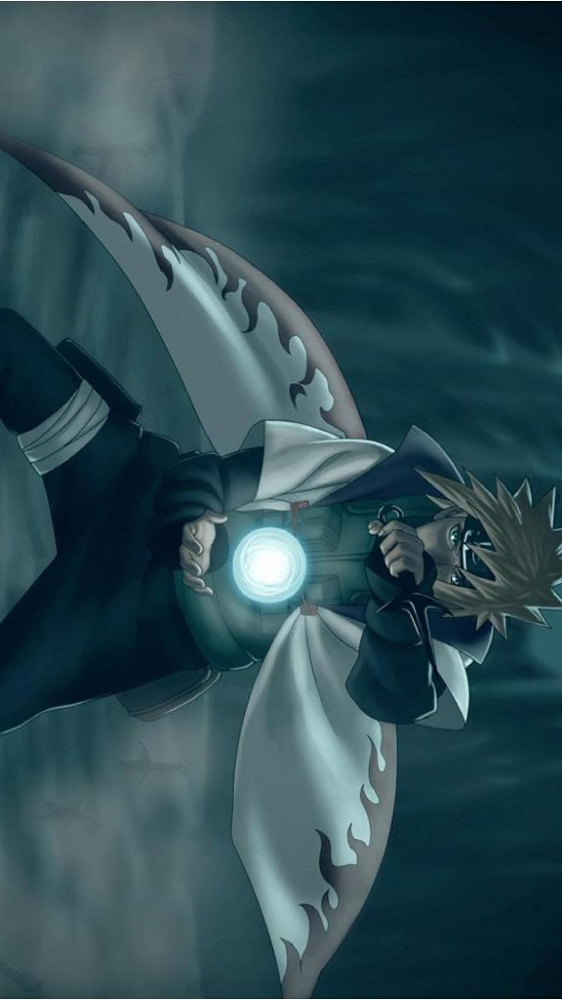
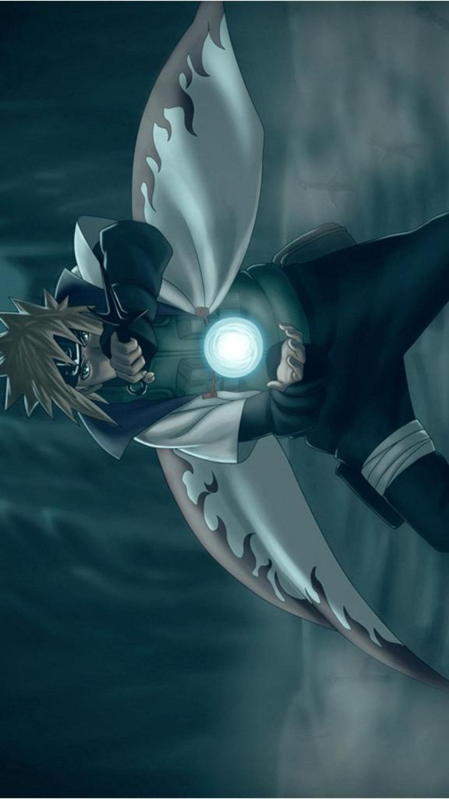
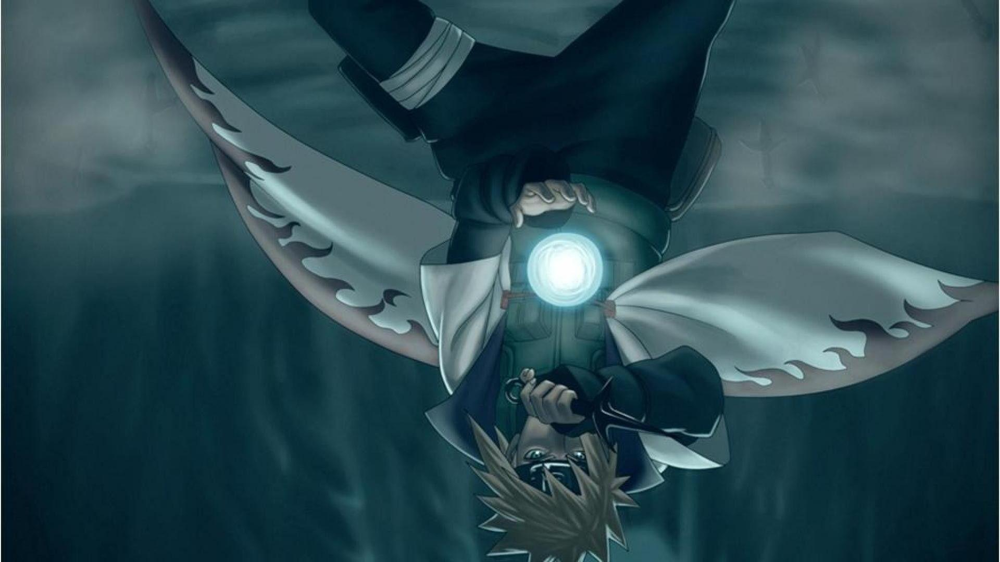
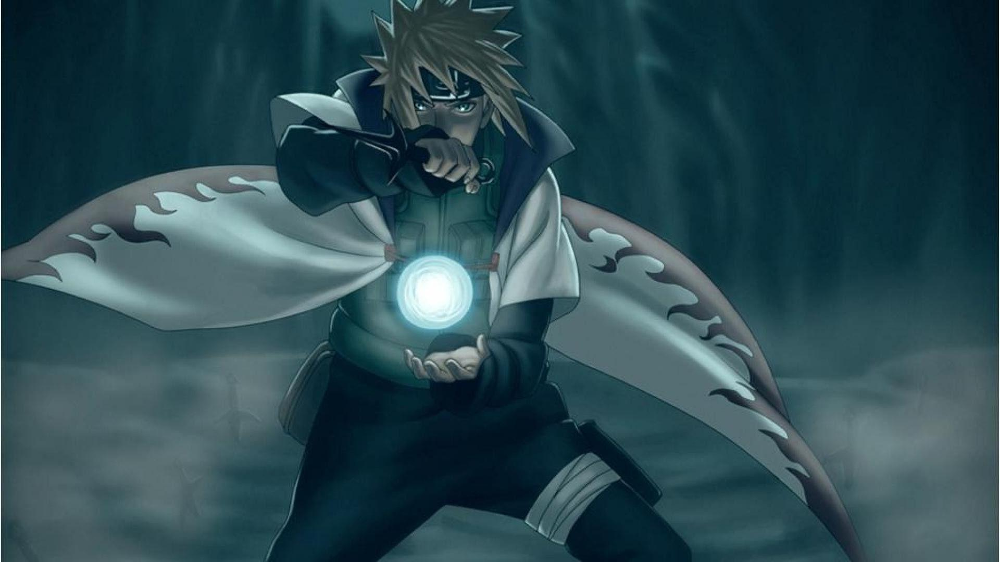
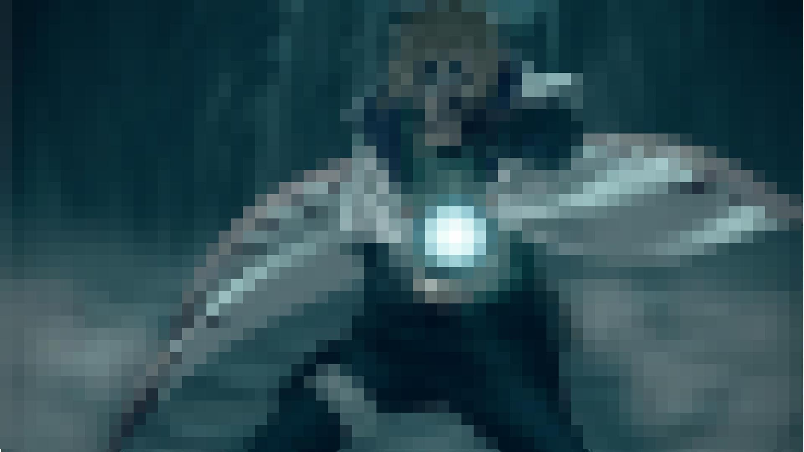
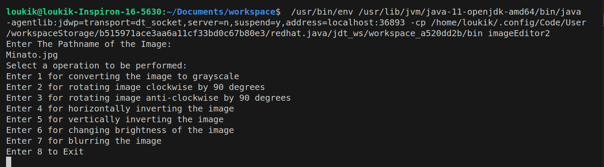
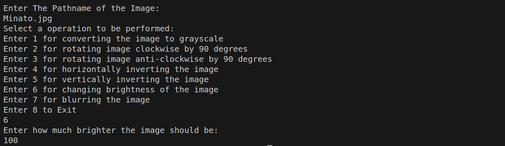
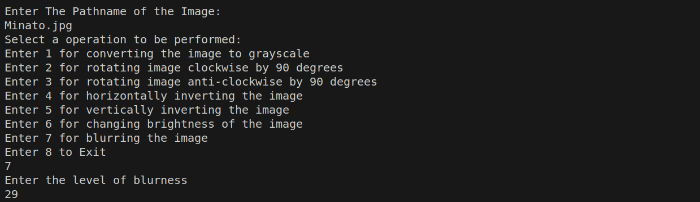

# Image Editor made with Java

Welcome to the Java Image Image_Editor – your all-in-one solution for image enhancement. This tool simplifies image manipulation with features such as grayscale conversion, rotation, brightness adjustment, inversion, and pixelated or Gaussian blur. Elevate your image editing game today and explore endless creative possibilities.

ORIGINAL IMAGE : 

## Features

- *Convert to Grayscale:* Transform colored images into grayscale.
  
  

- *Rotate:* Rotate images 90 degrees clockwise.
  
  

- *Rotate:* Rotate images 90 degrees anticlockwise.

  

- *Horizontal Invert:* Flip images horizontally.
  
  

- *Vertical Invert:* Flip images vertically.
  
  

- *Adjust Brightness:* Increase image brightness.
  
  

- *Adjust Brightness:* Decrease image brightness.

  

- *Blur Images:* Blur an image.

  
  

## Getting Started

Follow these steps to get started with the Java Image Editor:

### Prerequisites

- Java Installed on the device
- Any Java IDE.
- An Image.
### Libraries Needed:-
 - import java.io.File; 
 - import java.io.IOException;
 - import java.awt.Color;
 - import java.awt.image.BufferedImage;
 - import javax.imageio.ImageIO;
 - import java.util.*;
    
# All the Functions Explanations:-

1) GRAY SCALING :

- The method first retrieves the height and width of the input image to determine its dimensions.
- It creates a new BufferedImage, grayImage, with the same dimensions as the input image, but of type BufferedImage.TYPE_BYTE_GRAY, which represents a grayscale image.
- It iterates over each pixel in the input image using nested loops. For each pixel, it retrieves the RGB value (color) and sets the corresponding pixel in the grayImage to the same value. This process effectively converts each color pixel to its grayscale equivalent.
- After processing all pixels, the method returns the grayImage, which now contains the input image converted to grayscale.
   
2) ROTATE CLOCKWISE :
- The method first retrieves the height and width of the input image to determine its dimensions.
- It creates a new BufferedImage, outputImage, with swapped width and height compared to the input image, effectively creating a new image with rotated dimensions.
- It iterates over each pixel in the input image using nested loops. For each pixel, it retrieves the RGB value (color) from the input image and sets it in the outputImage with the row and column positions swapped. This swapping of rows and columns results in the image being rotated 90 degrees clockwise.
- After processing all pixels, the method proceeds with an additional step to complete the clockwise rotation:
   1) It calculates the new dimensions of the outputImage (swapped width and height).
   2) It iterates through half of the newWidth (the width of the rotated image divided by 2 and the full newHeight.
   3) For each pixel, it performs a swap operation between the left and right halves of the image columns, effectively rotating the image 90 degrees clockwise.
- After processing all pixels, the method returns the outputImage, which now contains the input image rotated 90 degrees clockwise.

3) ROTATE ANTI-CLOCKWISE
- The rotate clockwise function is used three times to give the same result as rotating anticlockwise.   

4) HORIZONTAL INVERSION : This Java code defines a method invertImageHorizontally to horizontally flip a BufferedImage. It iterates through half of the image's width, swapping pixel values from left to right within each row to create a horizontally inverted version of the input image. The result is stored in outputImage, which is returned at the end.

5) VERTICAL INVERSION : This Java method, invertImageVertically, flips the input image vertically along its horizontal axis. It iterates through half of the image's height and swaps pixel values between the top and bottom halves to achieve vertical inversion. The result is returned as outputImage.

6) CHANGE BRIGHTNESS : This Java code defines a method changeBrightness to adjust the brightness of a BufferedImage. It iterates through each pixel in the image, and based on the option parameter:
7) 
- if given value it positive, it increases the brightness by that percent.
- if given value is negetive, it decreases the brightness by that percent.
  
The adjusted pixel values are then set in the outputImage, which is returned as the result.
This code efficiently adjusts the brightness of the input image based on the specified percentage and option.

8) PIXELATED BLUR :
- The method retrieves the height and width of the input image to determine its dimensions.
- It creates a new BufferedImage, outputImage, with the same dimensions as the input image.
- It iterates through the input image in smaller grids of size sizeMatrix * sizeMatrix using nested loops:
- For each grid, it calculates the average red, green, and blue values by summing the color values of all pixels within the grid and dividing by the total number of pixels in the grid (sizeMatrix * sizeMatrix).
It then assigns the average color values to all pixels within the grid in the outputImage, effectively blurring the image within that grid.
After processing all grids, the method returns the outputImage, which now contains the input image with a blurring effect applied.

# Usage
- Open the project in your favorite Java IDE (e.g., Eclipse, IntelliJ IDEA, VS Code).

- Run the ImageEditor1.java file.
  1) Convert the image to grayscale.
  2) Rotate the image 90 degrees anticlockwise.
  3) Rotate the image 90 degrees clockwise.
  4) Change the brightness of the image (increase or decrease).
  5) Vertically invert the image.
  6) Horizontally invert the image (mirror image).
  7) Apply pixelated blur or Gaussian blur to the image.
The user also specifies additional parameters such as brightness adjustment percentage and blur amount where necessary.
- Follow the on-screen instructions to perform the desired operation on your image.
- After selecting the option the result image would be saved in the current working directory.
  
# CODE EXPLANATION :

This Java program, ImageEditor1, is a simple image processing tool that allows you to perform various operations on an input image. It provides the following image manipulation functionalities:

1) Convert to Grayscale: Converts the input image to grayscale.
2) Rotate Image Clockwise: Rotates the input image by 90 degrees clockwise.
3) Rotate Image Anticlockwise: Rotates the input image by 90 degrees anticlockwise.
4) Invert Image Horizontally: Horizontally inverts (mirrors) the input image.
5) Invert Image Vertically: Vertically inverts (flips) the input image.
6)Change Brightness: Increases or decreases the brightness of the image based on user input.
7) Apply Pixelated Blur: Applies a pixelated blur effect to the image based on a specified blur size matrix.

# HOW TO USE ? 
Run the program and provide the path to the input image file.

Choose one of the following operations by entering the corresponding number:

1) Convert to Grayscale
2) Rotate Image Clockwise
3) Rotate Image Anticlockwise 
4) Invert Image Horizontally
5) Invert Image Vertically
6) Change Brightness
7) Apply Pixelated Blur

- Depending on your choice, you may need to provide additional information such as the brightness change percentage or blur size matrix.

- Enter the name for the output image file (e.g., "output.jpg").

- The program will perform the selected operation on the input image and save the resulting image as the specified output file.

# OUTPUT OF THE CODE :

__________________________________________________________

ENJOY IMAGE EDITING WITH JAVA !

